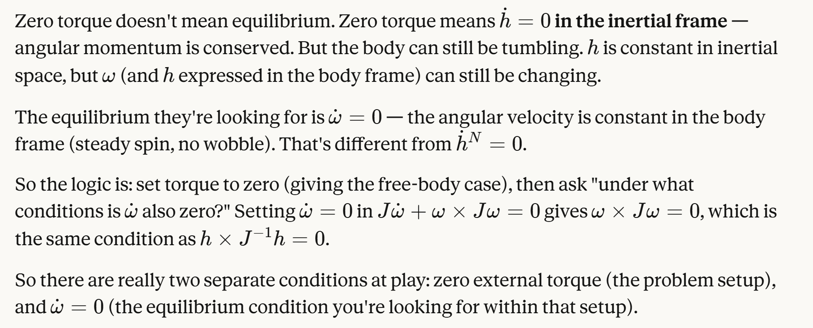

# getting equilibrium
This is context as to how we get the equilibrium condition from the L4 PDF notes. we use hdot=0 in the inertial frame to get the zero torque case. momentum conserved. then, we want equilibrium where omegadot is zero in the body frame. we know that hdot in the body frame is J*omegadot in the body frame. we require this to be zero => hdot is zero in body frame. sooo thats how you get the final condition.

# why h is eigenvector of J
and since the cross product means those two vectors on either side of the x are paralle, we can write Jinvh = lambda*h, so h is eigenvector of Jinv => eigenvector of J. (same eigenvectors, inverse eigenvalues). eigenvectors of J ARE the principal axes by definition. so its the same statement as above.

# stability analysis and why its linearization
the assumption that omega1 = omega0 >> omega2, omega3 is the lineaization.

lets us get rid of the omega2*omega3 term for example because small*small so negligible

we just get the big spin rate times a small perturbation in omega2 or omega3 (for the minor axis spin case with just omega1 dominant spin)

# on why it oscillates intuitively by looking at DE (very useful intuition here!) [linear stability analysis/checking the poles]
since alpha1 and alpha2 have opposite signs (alpha2 is negative), a small positive omeaga2 implies a small negative omega3dot. lets say it grows in negative direction. but then omega3 is small negative perturbation. that would mean small positive omegadot2 which reverses the perturbation in omega2. 

thus we'd see perturbations not running away, but reversing themselves. oscillation, like spring.

# min and max energy case
max energy is minor axis spin because need the most omega to achieve the same magnitude of h
and opposite for min energy case (maj axis spin)

min energy case has smallest energy ellipsoid that still touches the momentum sphere -> again, all the angular momentum is in the axis with the largest moment of inertia, so least omega and thus least energy to achive that h

